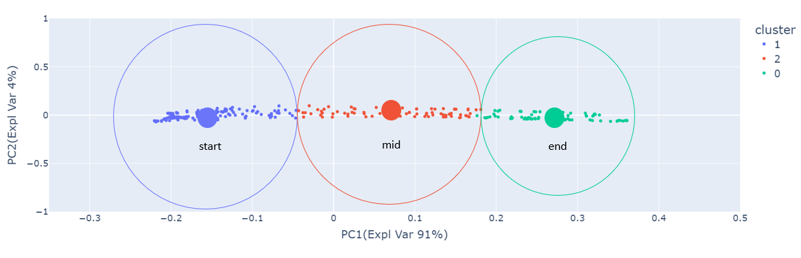

Magic
=================

## Overview
This repository contains code for comparing a user's pose to a given reference pose. 
The code funtions as a part of the software for a fitness app. Given a reference video of the correct way to do a particular exercise,
The following tasks are performed:
* Analyse the action being shown in the video and define it as the "correct action" with a certain "flexiblity".	
* Detect a user’s pose while exercising via a front-facing camera feed.
* Calculating how close their movements are to the correct body positioning defined previously.
* Counting their repetitions (reps) of the exercise.

Watch the Video B_annotated.mp4 for a quick  summary of the solution. 

## Contents 
The following are the sections in this repository:

1. [File] -Details of files and directories in this repository
2. [Usage] - Step by step instructions to execute this code
3. [Explanation] - Reasoning behind the code

## 1. Files
`data/` - Folder containing reference and test videos. Also saves annotated video and clustering model here. \
`params.py` - Edit this file for changing paths. It also declares values of all parameters used in this solution. \
`define_action.py` - Code for defining "Wave" action based on reference Video. \
`monitor_action.py` - Process User provided Video and compare action with pre defined action. \
`console_output.mp4` - Screen recording of console output for `monitor_action.py`. \
`utils.py` - Wave action Class and member functions.\
`requirements.txt` - Contains all package dependencies.\
`README.md` - Readme file for this repository.\
`magic.ipynb` - jupyter notebook of the implementation.

## 2. Usage

Please make sure you are using Python >= 3.7 so that the latest MediaPipe library is intsalled. This is very important. 
Some functions used in this code are not available in older versions of MediaPipe library. 
Follow the instructions in the steps mentioned below for implementation on a linux environment. Alternatively a jupyter notebook is provided.

### Step 1: Clone repository
Open a linux terminal and clone this repository to your workspace using:
```
git clone https://github.com/prchinmay/magic.git 
cd magic/

```

### Step 2: Create new virtual environment
Before intalling dependencies, let us first create a new virtual environment using(ensure Python >= 3.7):
```
python3 -m pip install --user virtualenv &
python3 -m virtualenv magic &
source magic/bin/activate
```
### Step 3: Install Dependencies
Install dependiencies using:
```
pip install -r requirements.txt

```

### Step 4: Run Codes

After dependencies are installed, run `define_action.py` to define "Wave" action from Video A. 
Run `monitor_action.py` to analyse frames from Video B and compare it with defined action in Video A.
```
python3 define_action.py 
python3 monitor_action.py

```
### Results
Total "Wave" action reps and percentage completion of current Wave action are printed to the console frame by frame. 
If `annotate_vid()` is enabled in `monitor_action.py`, then annotations of Video B is saved inside the `data` folder.
 

## 3. Explanation
This Section provides the reasoning behind the code utilised in this solution. 

### Defining the Wave action from Video A
This is performed in `define_action.py`. Pose data from all frames in Video A are extracted and stored in in variable `action` using `get_pose()` method. 
A simple K-Means clustering is performed on this data to define the action and identify the intermediate *steps*. The `n_clusters` hyperparameter gives the number of *steps* in the Wave action.
In this solution 3 *steps* are identified— 1)start, 2)mid, 3)end. "start" and "end" are extreme positions and "mid" is the intermediate position. If more intermediate *steps* are required, 
`n_clusters` can be defined appropriately. Figure below shows a 2D PCA(Principal Component Analysis) projection of the clustered poses in Wave action from Video A. 


K-Means clustering was chosen for the following reasons:
* **speed**: K-Means is one of the fastest ML algorithms especially for unsupervised data. This should work well for real time processing.
* **scalablity**: K-Means scales well for large datasets for less number of clusters. It is expected that intermediate steps is less than 10 for any action.
* **data driven**: Does not need manual supervision/ feature engineering. Intermediate steps is diveded into clusters without explicitly defining. 
Although it does allow a user to input priors(if required).
* **application**: The intuition behind using clustering was the context provided by the assignment document. The fitness app guides a user to follow a reference action. 
An action typically should have intermediate *steps* which have to be achieved with a certain *accuracy*. This is particularly the case for Yoga, weightlifting, pilates etc,. 
K-Means clustering identifies these *steps* as clusters of points having a cluster center. The cluster center corresponds to the ideal pose(that of the top athlete).
This allows us to determine how accturate is a user's pose compared to the closest reference *step*(cluster center). 

### Comparing a User's action in Video B to refrence action in Video A
This is performed in `monitor_action.py`. Again, pose data from Video B is extracted frame by frame using `get_pose()` method. This is then processed by the method `get_status()` by using 
cluster model weights from the previous step. In the figure shown below, *p<sub>i</sub>* reresents the reference ideal pose of the top athlete. Let *p<sub>i</sub>* be the user's pose at any point in time. 
Then, the similarity of the user's pose to the closest ideal pose, is given by the formulas for *S<sub>ij</sub>* below. The metric is a modified version of the 
cosine similarity metric used in pose detection networks. The modification is performed to increase sensitivity for poses that are close to each other. 
The advantage of using cosine similarity over euclidean distance, is that it is not corrupted by the magnitude of the vectors. This means that the persons height, limb size, position etc., 
do not matter as long as the two poses are similar. This is desired for application to real world scenario. In the code, *S<sub>ij</sub>* is stored in the variable `sim_to_clust`.
If this value is within a pre-defined threshold, the action is accepted. If it is above the threshold, the action is rejected and the `rep` is not counted. 
The threshold is determmined by determining similarity between two closest cluster centers. The *accuracy* of a user's pose to the reference pose is printed 
on screen and given by 100 - *S<sub>ij</sub>*. 

The figure below shows an example stituation of a user's pose deviating from the reference path. This happens when the point is too far away from the closest cluster center. 
The UI then throws a warning message to correct the user.   
   
The figure below shows an example stituation of a user's pose following the reference path. The UI shows progress of current rep and the total reps completed. 
 


  
